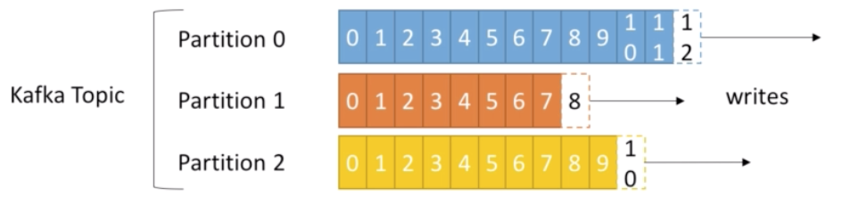
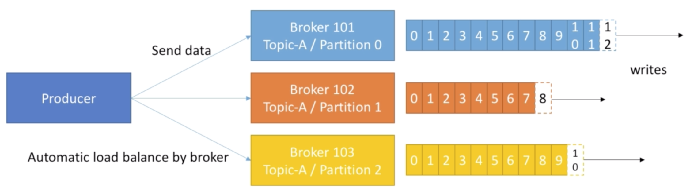
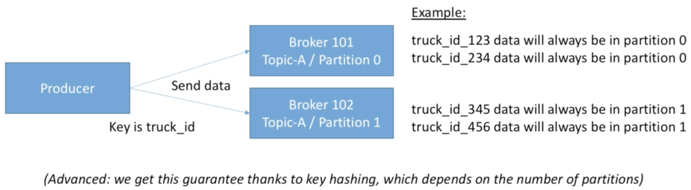

## Topics
Is a particular stream of data
- Similar to a table in a database (without all the constraints)
- You can have as many topics as you want
- A topic is identified by its name


## Topics are split by Partitions
- Each partition is ordered
- Each message within a partition gets an incremental id, called offset


## Offsets
- Offset only have a meaning for a specific partition (e.g offset 3 in partition 0 doesn't represent the same data as offset 3 in partition 1)
- Order only guaranteed only within a partition (not across partitions)
- Data is kept only for a limited time (default in one week)
- Once the data is written to a partition, it can't be changed (immutability)
- Data is assigned randomly to a partition unless a key is provided 


## Brokers
- A Kafka clusters is composed of multiple brokers (servers)
- Each broker is identified with its ID (integer)
- Each broker contains certain topic partitions
- After connecting to any broker (Called a bootstrap broker), you will be connected to the entire cluster
- A good number to get started is 3 brokers, but some big clusters have over 100 brokers


## Brokers and topics
Example of Topic-A with 3 partitions and 100 brokers 
- Broker_101 will have Topic-A/Partition_0
- Broker_102 will have Topic-A/Partition_1
- Broker_103 will have Topic-A/Partition_3

Example of Topic-A with 2 partitions and 100 brokers 
- Broker_101 will have Topic-A/Partition_0
- Broker_102 will have Topic-A/Partition_1


## Replication
- Topic replication factor > 1 (usually between 2 and 3)
- This way if a broker is down, another broker can serve the data

Example: Topic-A with 2 partitions and replication factor of 2 (2 copies)
- Broker_101 will have Topic-A/Partition_0(Leader)
- Broker_102 will have Topic-A/Partition_0(ISR)
- Broker_102 will have Topic-A/Partition_1(Leader)
- Broker_103 will have Topic-A/Partition_1(ISR)


## Leader for a Partition
- At any time only ONE broker can be a leader for a given partition
- Only that leader can receive and serve data for a partition
- The other brokers will sync the data
- Therefore each partition has one leader and multiple ISR (in-sync replica)


## Producer
- Producers write data to topics (which is made of partitions)
- Producers automatically know to which broker and partition to write to
- In case of Broker failures, Producers will automatically recover




## Producers and acknowledgement
Producers can choose to receive acknowledgement of data writes:
- acks=0: Producer won't wait for acknowledgement (possible data loss)
- acks=1 (default setting): Producer will wait for the leader to acknowledge (limited data loss)
- acks=all: Leader + replicas acknowledgement (no data loss)


## Producer and msg keys
- Producers can choose to send a ket with the message (string, number, etc)
- If key=null, data is sent round robin (broker 101 then 102 then 103.....)
- If a key is sent, then all messages for that key will always go to the same partition
- A key is basically sent if you need message ordering for a specific field




## Start zookeeper
zookeeper-server-start.sh ./config/zookeeper.properties

## Start kafka broker
kafka-server-start.sh config/server.properties


## Create topics
kafka-topics.sh --zookeeper 127.0.0.1:2181 --topic first_topic --create --partitions 3 --replication-factor 1

kafka-topics.sh --zookeeper 127.0.0.1:2181 --topic second_topic --create --partitions 6 --replication-factor 1

--replication-factor cannot be greater than number of brokers

## List of topics 
kafka-topics.sh --zookeeper 127.0.0.1:2181 --list

## Topic details
kafka-topics.sh --zookeeper 127.0.0.1:2181 --topic first_topic --describe

kafka-topics.sh --zookeeper 127.0.0.1:2181 --topic second_topic --describe

## Delete topics
kafka-topics.sh --zookeeper 127.0.0.1:2181 --topic second_topic --delete

## Producer (default props)
kafka-console-producer.sh --broker-list 127.0.0.1:9092 --topic first_topic

## Producer (custom props)
kafka-console-producer.sh --broker-list 127.0.0.1:9092 --topic first_topic --producer-property acks=all

## Producer (write to non existing topic -> will be created on the fly)
kafka-console-producer.sh --broker-list 127.0.0.1:9092 --topic new_topic

kafka-topics.sh --zookeeper 127.0.0.1:2181 --list

kafka-topics.sh --zookeeper 127.0.0.1:2181 --topic new_topic --describe
Creates topic with Partition qty of 1 and Replication factor qty of 1

Best practice - always create topic beforehand

However we can also update default config in "server.properties" file
``` bash
...
# A comma separated list of directories under which to store log files
log.dirs=/Users/mopom/kafka/kafka_2.12-2.0.0/data/kafka

# The default number of log partitions per topic. More partitions allow greater
# parallelism for consumption, but this will also result in more files across
# the brokers.
num.partitions=3

# The number of threads per data directory to be used for log recovery at startup and flushing at shutdown.
...
```

kafka-topics.sh --zookeeper 127.0.0.1:2181 --topic new_topic_2 --describe
kafka-console-producer.sh --broker-list 127.0.0.1:9092 --topic new_topic_2

## Producer with keys
kafka-console-producer --broker-list 127.0.0.1:9092 --topic first_topic --property parse.key=true --property key.separator=,
> key,value
> another key,another value


## Consumer
Command only intercepts msg as from launch - won't retrieve missed msg
kafka-console-consumer.sh --bootstrap-server 127.0.0.1:9092 --topic first_topic 

## Consumer (read from beginning)
kafka-console-consumer.sh --bootstrap-server 127.0.0.1:9092 --topic first_topic --from-beginning

## Consumer Same Group
Console 1
kafka-console-consumer.sh --bootstrap-server 127.0.0.1:9092 --topic first_topic --group my-first-application
Console 2
kafka-console-consumer.sh --bootstrap-server 127.0.0.1:9092 --topic first_topic --group my-first-application
Console 3
kafka-console-consumer.sh --bootstrap-server 127.0.0.1:9092 --topic first_topic --group my-first-application

## Consumer Different Group
kafka-console-consumer.sh --bootstrap-server 127.0.0.1:9092 --topic first_topic --group my-second-application --from-beginning

## Groups
kafka-consumer-groups.sh --bootstrap-server 127.0.0.1:9092 --list
When use consumer and don't specify groups -> it generates a random one

kafka-consumer-groups.sh --bootstrap-server localhost:9092 --describe --group my-second-application

kafka-consumer-groups.sh --bootstrap-server localhost:9092 --describe --group my-first-application

## Resetting Offsets
kafka-consumer-groups.sh --bootstrap-server localhost:9092 --group my-first-application --reset-offsets --to-earliest --execute --topic first_topic

kafka-consumer-groups.sh --bootstrap-server localhost:9092 --group my-first-application --reset-offsets --shift-by -2 --execute --topic first_topic

Note -> use negative to move back; also does it for each partition (if 3 partition x 2 => consumer will receive 6 msg)

## Consumer with keys
kafka-console-consumer --bootstrap-server 127.0.0.1:9092 --topic first_topic --from-beginning --property print.key=true --property key.separator=,

___

kafka-console-consumer.sh --bootstrap-server 127.0.0.1:9092 --topic first_topic --group my-third-application